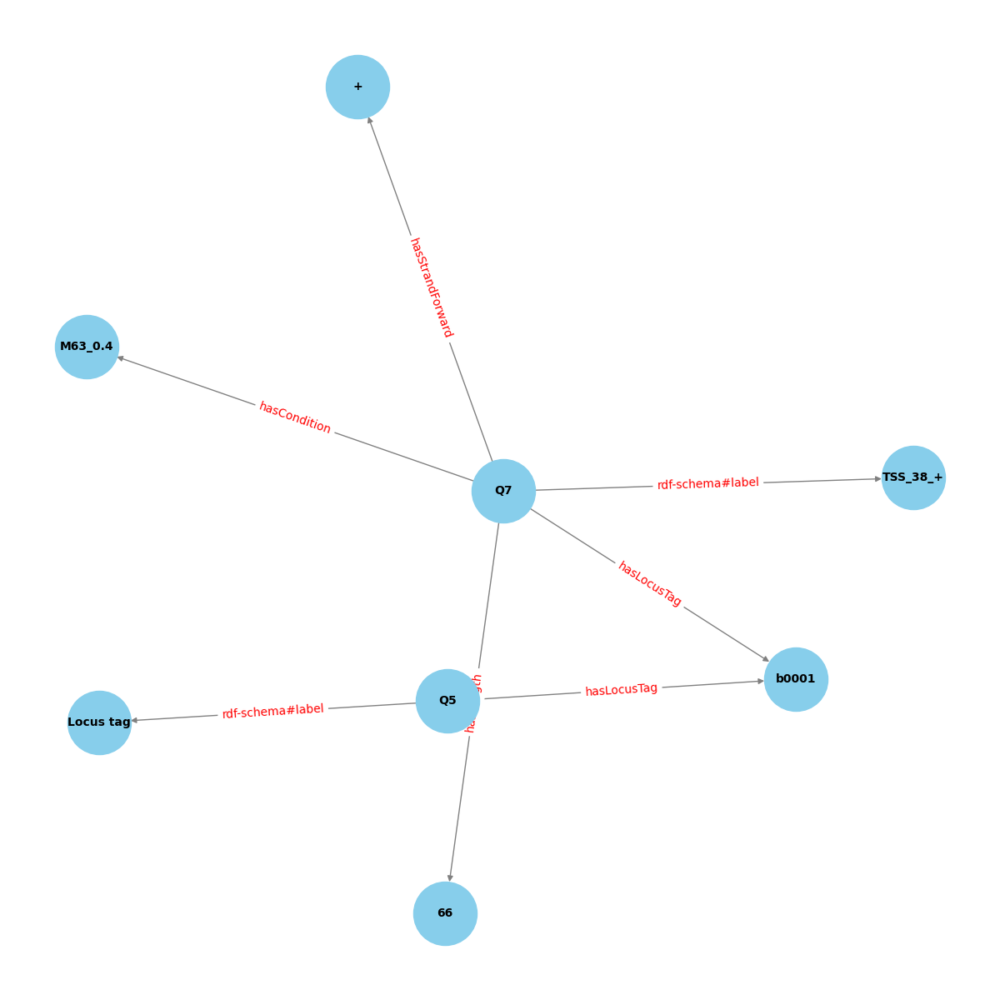

# DIS18_Projekektarbeit_Gruppe1

## Project Goal

The goal of this project is to build a wikibase cloud instance containing data generated from sequencing. We aimed to transform TSS data into a knowledge graph. The project is built according to the FAIR principles.

Objectives
- Data Extraction: Extract data from sequencing outputs, specifically focusing on Transcriptional Start Sites (TSS).
- Data Transformation: Convert the extracted data into RDF (Resource Description Framework) format suitable for a knowledge graph.
- Knowledge Graph Creation: Populate a knowledge graph using the transformed data, utilizing either a custom Wikibase instance or Wikidata.

The steps to do so would be: 

1. Create an Instance
2. Define & create properties in Wikibase Cloud Instance
3. Import Data: prepare data & create a CSV for bulk uploads using QickStatements in Wikibase Cloud Instance
4. Query the data using SPARQL
5. Use this data to create and display a Knowledge Graph

## What is TSS data? 

A transcription start site (TSS) is the location where the first DNA nucleotide is transcribed into RNA. It is difficult to determine the exact position of the TSS using bioinformatics, but experimental methods can be used to locate it, notably high throughput sequencing. (France Génomique. 2024. Online available: https://www.france-genomique.org/technological-expertises/regulome/mapping-of-transcription-start-sites-tss/?lang=en)

Our data contains the following information on TSS: 

"""
- Pos: The position of the TSS in the genome.
- Strand: The strand of the TSS in the genome.
- detCount: The number of genomes in which this TSS was detected in the RNAseq data.
- Condition: The biological condition to which the rest of the line relates.
- detected: Contains a '1' if the TSS was detected in this condition.
- enriched: Contains a '1' if the TSS is enriched in this condition.
- stepHeight: The expression height change at the position of the TSS. This relates to the number of reads starting at this position.
- stepFactor: The factor of height change at the position of the TSS.
- enrichmentFactor: The enrichment factor at the position of the TSS.
- classCount: The number of classes to which this TSS was assigned.
- Locus_tag: The locus tag of the gene to which the classification relates.
- Product: The product description of this gene.
- UTRlength: The length of the untranslated region between the TSS and the respective gene (nt). (Only applies to 'primary' and 'secondary' TSS.)
- GeneLength: The length of the gene (nt).
- Primary: Contains a '1' if the TSS was classified as 'primary' with respect to the gene stated in 'locusTag'.
- Secondary: Contains a '1' if the TSS was classified as 'secondary' with respect to the gene stated in 'locusTag'.
- Internal: Contains a '1' if the TSS was classified as 'internal' with respect to the gene stated in 'locusTag'.
- Antisense: Contains a '1' if the TSS was classified as 'antisense' with respect to the gene stated in 'locusTag'.
- Automated: Contains a '1' if the TSS was detected automatically.
- Manual: Contains a '1' if the TSS was annotated manually.
- Putative sRNA: Contains a '1' if the TSS might be related to a novel sRNA.
- Putative asRNA: Contains a '1' if the TSS might be related to an asRNA.
- Sequence −50 nt upstream + TSS (51nt): Contains the base of the TSS and the 50 nucleotides upstream of the TSS.
- Overlap with RegulonDB: Contains an X for all primary and secondary TSS that match a RegulonDB TSS classified as primary or secondary (according to our scheme) with a maximum distance of three nucleotides.
"""

We mainly used these data: Pos, Strand, Condition, Locus Tag, GeneLength

## What's in the Wikibase instance

In this project, data generated from sequencing data will be transferred to a knowledge graph. For this, we use a Wikibase cloud instance. The instance can be reached with the following link: https://dis18project.wikibase.cloud
Besides this, you'll find some data to (semi-)automatically fill this instance. Additionally, you'll find some TSS data (https://dl.acm.org/doi/10.1145/3397512) that's used for the example usage section. 

In the Wikibase Cloud Instance, you'll find the following properties: 

1. has locus tag (P6) [String]
2. has length - (P7) [String]
3. has strand (forward) - (P8) [String]
4. has strand (reverse) - (P9) [String]
5. has condition (P10) [String]
6. has strand reverse - (P11) [String]
7. has start position - (P12) [String]
8. is instance of (P13) [Item]
9. is at position (P14) [String]
10. relates to (P16) [Item]
11. detected under condition (P17) [Item]

The other properties are deprecated.

## Information on the files in this repo 

Note: all files contain short documentation at the beginning of each file.

### create_initial_items.py 

This task creates the quickstatements for the initial items that are referenced in the following tasks and stores them into data/quickstatements/initial_items. The items are:
* Transcription Start Site 
* Gene
* Conditions
    * M63_0.4
    * LB_0.4
    * LB_2.0

### create_items_genes.py

This task creates the quickstatements for gene items and stores them into data/quickstatements/genes. As label the locus_tag is used. The description is provided by the "Product" column of our input excel. Moreover, the gene length is added. An example of a statement is: 
< b0001 > (thr operon leader peptide) < is instance of > < qid for Gene > < has length > < 66 >

### create_items_tss.py

This task creates the quickstaetments for tss items and stores them into data/quickstatments/tss. As label a combination of the position and the strand is used, which is also written in the description. Moreover it adds information on:
* position
* strand 
* qid of the gene it relates to 
* qid under which condition it was detected 

An example of a statement is:
< 38_+ > (Transcription Start Site: Label was assembled by the position and strand of the TSS) 
< is instance of > < qid for TSS > < has position > < 38 > < is on strand > < + > < relates to > < qid of gene > 
< detected under condition > < qid of condition >

### knowledge_graph.py

This script automates the process of querying a Wikibase Cloud instance to retrieve data and convert it into a knowledge graph represented in RDF (Resource Description Framework) format. The script uses the requests library to execute SPARQL queries and the rdflib library to construct and serialize the RDF graph. It starts with defining a SPARQL query that fetches all relevant information from the Wikibase instance. The query retrieves items along with their properties such as locus tag, length, strand information, condition, and start position. Then, the script constructs an RDF graph using the rdflib library. It defines a namespace and properties, and dynamically adds triples to the graph based on the query results.

### display_knowledge_graph.py

This script visualizes an RDF knowledge graph using NetworkX and Matplotlib. The RDF graph is loaded from a Turtle file, converted into a NetworkX graph, and then visualized using Matplotlib.

## Setup

First, you need to clone this repository to your local dev environment. To do so, use git clone and the options given by github. After that, you can access these files in the following order: 

- create_initial_items: to create the initial items (*)
- create_items_genes: to create the items for the different genes (*)
- create_items_tss: to create the final items for the tss (*)
- knowledge_graph.py: to get back information from Wikibase cloud and to create a knowledge graph
- display_knowledge_graph.py: to visualize created knowledge graph

(*) Note: The tasks are wrapped in the luigi framework. When running create_items_tss, the whole pipeline will run
starting with create_initial_items.py. At the moment the quickstatments have to be inserted manually using the wikibase interface
at a later point they should be inserted automatically. For the moment, one has to run the tasks one after another and insert them before running the following task. 

## Example Usage 

1. create the initial items and upload them into the wikibase instance 
2. create the gene items and upload them into the wikibase instance
3. create the tss items and upload them into the wikibase instance
4. Run script "knowledge_graph.py" to create a knowledge graph out of the items in the instance.
5. Run script "display_knowledge_graph.py" to create a simple visualization of the knowledge graph created. 

A final knowledge graph with the example data used can look like this: 

## Learnings

To build this instance we gathered some learnings we want to display in this section. 
At first, we weren't sure on how to get data as statements into the Cloud Instance. At first, we tried using pandas for reading the excel file and rdflib to create a knowledge graph. The excel file were split manually into an edges and a nodes section. This attempt didn't work because we had a false understanding on what knowledge graphs would be. We had several attempts on this. 

After giving up on this, we tried creating statements in our cloud instance manually, which worked good. At first, we started to set up some properties and items. With these we wanted to form statements. Here we learnt that it's essential to use the right data type in the properties. 
From there we tried using Quick Statements. Here we learnt that they need to have a specific syntax to work, a csv file worked best for us. (Guidance on this can be found here: https://www.wikidata.org/wiki/Help:QuickStatements)

## Ideas for additions 

- The use of Neo4j can help visualize the RDF graphs. As visualization currently is really simple there's room for optimisation.
- The Luigi pipeline can handle the whole process automatically if the authentication will be handled properly. With this, the pipeline will handle everything from reading in the excel files to creating the quick statements.
- To create full automation, providing an it_container in which credentials and env variables can be set is necessary. Also, inserting the quick statements in each luigi task needs to be done for automation.
- The modelling of the statements needs further adjustment in the future.

## Glossary 

### Biological terms 
- TSS: The transcription start site where transcription of a gene begins
- Locus Tag: A unique identifier assigned to a specific gene or genetic locus
- Strand: The directionality of the DNA or RNA strand involved in transcription or replication
- Position: The specific location of a genetic feature on a chromosome

### Technical terms
- Knowledge Graph: A structured representation of data using entities and relationships to enable semantic querying and reasoning
- RDF: Resource Description Framework, a standard for representing structured information about resources in a graph format
- Namespace: A mechanism to avoid name conflicts by providing a unique context for identifiers
- Turtle: A syntax for writing RDF data in a compact and human-readable form
- NetworkX: A Python library for the creation, manipulation, and study of complex networks
- Matplotlib: A Python library for creating static, interactive, and animated visualizations in a variety of formats
- SPARQL: A query language and protocol for querying and manipulating RDF data in a semantic web context

You can find additional information and documentation here: 
- https://www.ibm.com/topics/knowledge-graph
- https://rdflib.readthedocs.io/en/stable/
- https://www.w3.org/TR/turtle/
- https://networkx.org/
- https://matplotlib.org/
- https://www.w3.org/TR/sparql11-query/
- https://jingdongsun.medium.com/creating-knowledge-graph-step-by-step-a383231acf2d

